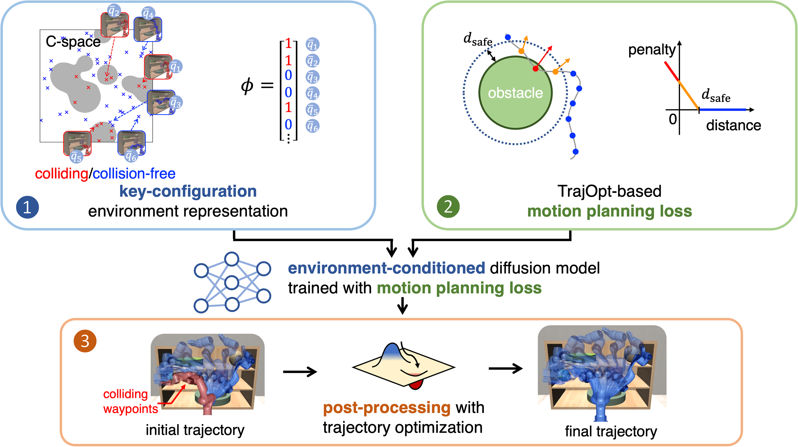

# PRESTO: Fast motion planning using diffusion models based on key-configuration environment representation
[Mingyo Seo](https://mingyoseo.com)&ast;, [Yoonyoung Cho](https://yycho0108.github.io/research)&ast;, [Yoonchang Sung](https://yoonchangsung.com/), [Peter Stone](https://www.cs.utexas.edu/~pstone/), [Yuke Zhu](https://www.cs.utexas.edu/~yukez)&dagger;, [Beomjoon Kim](https://beomjoonkim.github.io/)&dagger;

[Project](https://kiwi-sherbet.github.io/PRESTO) | [arXiv](https://arxiv.org/abs/2409.16012)



## Abstract
We introduce a learning-guided motion planning framework that provides initial seed trajectories using a diffusion model for trajectory optimization. Given a workspace, our method approximates the configuration space (C-space) obstacles through a key-configuration representation that consists of a sparse set of task-related key configurations, and uses this as an input to the diffusion model. The diffusion model integrates regularization terms that encourage collision avoidance and smooth trajectories during training, and trajectory optimization refines the generated seed trajectories to further correct any colliding segments. Our experimental results demonstrate that using high-quality trajectory priors, learned through our C-space-grounded diffusion model, enables efficient generation of collision-free trajectories in narrow-passage environments, outperforming prior learning- and planning-based baselines.

If you find our work useful in your research, please consider [citing](#citing).

## Code will be released soon. Stay tuned!

## Citing
```
@misc{seo2024presto,
        title={PRESTO: Fast motion planning using diffusion models based on
          key-configuration environment representation},
        author={Seo, Mingyo and Cho, Yoonyoung and Sung, Yoonchang and Stone, Peter and Zhu, Yuke and Kim, Beomjoon},
        year={2024}
        eprint={2409.16012},
        archivePrefix={arXiv},
        primaryClass={cs.RO}
      }
```