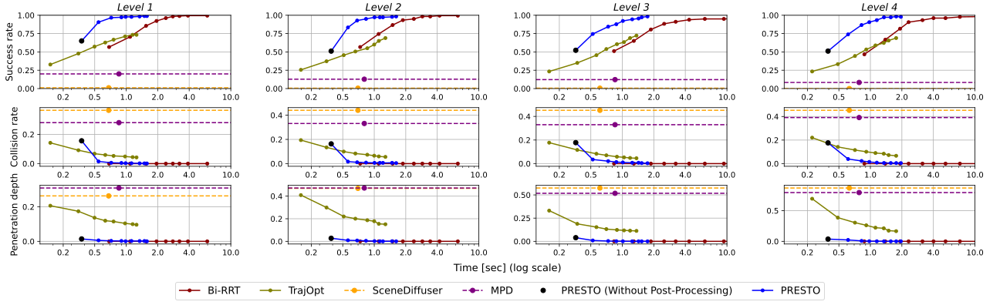
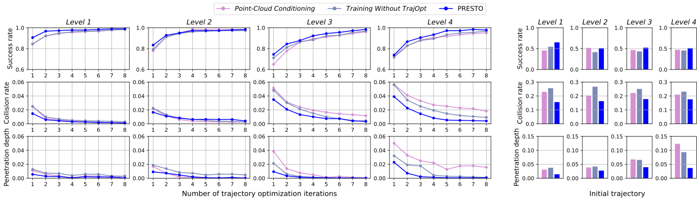
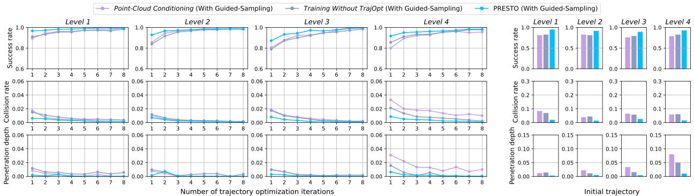

<link media="all" href="./css/glab.css" type="text/css" rel="StyleSheet">
<link href='https://fonts.googleapis.com/css?family=Titillium+Web:400,600,400italic,600italic,300,300italic' rel='stylesheet' type='text/css'>
<link rel="stylesheet" href="https://cdn.jsdelivr.net/gh/jpswalsh/academicons@1/css/academicons.min.css">

<head>

<title>PRESTO: Fast Motion Planning Using Diffusion Models Based on Key-Configuration Environment Representation</title>

<meta http-equiv="Content-Type" content="text/html; charset=UTF-8">
<meta property="og:title" content="PRESTO">
<meta property="og:description" content="PRESTO: Fast Motion Planning Using Diffusion Models Based on Key-Configuration Environment Representation">
<meta property="og:image" content="https://raw.githubusercontent.com/kiwi-sherbet/PRESTO/main/docs/imgs/overview.png">
<meta property="og:url" content="https://kiwi-sherbet.github.io/PRESTO/">

<!-- Google tag (gtag.js) -->

</head>

<body data-gr-c-s-loaded="true">

  <h1>
    <strong>PRESTO: Fast Motion Planning Using Diffusion Models Based on Key-Configuration Environment Representation</strong>
  </h1>

  <h3>
    <a href="https://mingyoseo.com/">Mingyo Seo1*</a>&nbsp;&nbsp;&nbsp;
    <a href="https://yycho0108.github.io/research">Yoonyoung Cho2*</a>&nbsp;&nbsp;&nbsp;
    <a href="https://yoonchangsung.com/">Yoonchang Sung1</a>&nbsp;&nbsp;&nbsp;
    <a href="https://www.cs.utexas.edu/~pstone/">Peter Stone1</a>&nbsp;&nbsp;&nbsp;
    <a href="https://yukezhu.me/">Yuke Zhu1&dagger;</a>&nbsp;&nbsp;&nbsp;
    <a href="https://beomjoonkim.github.io/">Beomjoon Kim2&dagger;</a>&nbsp;&nbsp;&nbsp; 
  </h3>
  <h3>
    <a href="https://www.utexas.edu/">1UT Austin</a>&nbsp;&nbsp;&nbsp;
    <a href="https://www.kaist.ac.kr/en/">2KAIST</a>&nbsp;&nbsp;&nbsp;
    * Equal contribution&nbsp;&nbsp;&nbsp;
    &dagger; Equal advising
  </h3>
  <h3>IEEE International Conference on Robotics and Automation (ICRA), 2025</h3>
  <h3>
    <a href="https://arxiv.org/abs/2409.16012">
      <i class="ai ai-arxiv"></i> Paper</a> |
    <a href="https://github.com/kiwi-sherbet/PRESTO">
      <i class="fa-brands fa-github"></i> Code</a> |
    <a href="./src/file/appendix.pdf" download>
      <i class="fa-solid fa-file-pdf"></i> Appendix</a>
  </h3>

  

    
  

<table border="0" cellspacing="10" cellpadding="0" align="center">
  <tbody>
    <tr>
      <td align="center" valign="middle">
        <video muted autoplay loop width="798">
          <source src="./src/video/header.mp4"  type="video/mp4">
        </video>
      </td>
    </tr> 
  </tbody> 
</table>

<table align=center width=800px>
  <tr>
    <td>
      

        We introduce a learning-guided motion planning framework that generates seed trajectories using a diffusion model for trajectory optimization. Given a workspace, our method approximates the configuration space (C-space) obstacles through an environment representation consisting of a sparse set of task-related key configurations, which is then used as a conditioning input to the diffusion model. The diffusion model integrates regularization terms that encourage smooth, collision-free trajectories during training, and trajectory optimization refines the generated seed trajectories to correct any colliding segments. Our experimental results demonstrate that high-quality trajectory priors, learned through our C-space-grounded diffusion model, enable the efficient generation of collision-free trajectories in narrow-passage environments, outperforming previous learning- and planning-based baselines.
      

    </td>
  </tr>
</table>

<h1 align="center">Main Results</h1>
<table border="0" cellspacing="10" cellpadding="0" align="center">
  <tbody>
    <tr>
      <td align="center" valign="middle">
        <video muted controls width="190">
          <source src="./src/video/level1.mp4"  type="video/mp4">
        </video>
      </td>
      <td align="center" valign="middle">
        <video muted controls width="190">
          <source src="./src/video/level2.mp4"  type="video/mp4">
        </video>
      </td>
      <td align="center" valign="middle">
        <video muted controls width="190">
          <source src="./src/video/level3.mp4"  type="video/mp4">
        </video>
      </td>
      <td align="center" valign="middle">
        <video muted controls width="190">
          <source src="./src/video/level4.mp4"  type="video/mp4">
        </video>
      </td>
    </tr>
  </tbody>
</table>
<table align=center width=800px>
  <tr>
    <td>
      

        We evaluate our method on a motion planning task using the Franka Emika Panda robot arm to traverse a 3-tier shelf with various objects in simulation. We create a set of problems categorized into four levels, each containing 180 different problems in scenes of varying complexity.
      

    </td>
  </tr>
</table>
 
<table border="0" cellspacing="10" cellpadding="0" align="center" width=800px> 
  <tbody>
    <tr>
      

        <td align="center" valign="middle">
          
        </td>
      

    </tr>
  </tbody>
</table>
<table border="0" cellspacing="10" cellpadding="0" align="center">
  <tbody>
    <tr>
      <td align="center" valign="middle">
        <video muted controls width="258">
          <source src="./src/video/birrt.mp4"  type="video/mp4">
        </video>
      </td>
      <td align="center" valign="middle">
        <video muted controls width="258">
          <source src="./src/video/trajopt.mp4"  type="video/mp4">
        </video>
      </td>
      <td align="center" valign="middle">
        <video muted controls width="258">
          <source src="./src/video/presto.mp4"  type="video/mp4">
        </video>
      </td>
    </tr>
    <tr>
      <td>        
      </td>
      <td>
      </td>
      <td>
        

          Collision-free/Colliding
        

      </td>
    </tr>
  </tbody>
</table>
<table align=center width=800px>
  <tr>
    <td>
      

        Across all levels, PRESTO consistently outperforms the pure learning algorithms <a href="https://scenediffuser.github.io/">SceneDiffuser</a> and <a href="https://arxiv.org/abs/2308.01557">Motion Planning Diffuser (MPD)</a>, which lack a key-configuration environment representation and a motion-planning objective, respectively. Compared to Bi-RRT, PRESTO uses diffusion-learned trajectory priors to generate collision-free trajectories more efficiently, especially in narrow passages. Additionally, compared to <a href="https://rll.berkeley.edu/trajopt/doc/sphinx_build/html/">TrajOpt</a>, an optimization-based method, PRESTO's high-quality initial trajectories lead to faster convergence in complex domains, despite the computational overhead of running the diffusion model.
      

    </td>
  </tr>
</table>

<h1 align="center">Ablation Studies</h1>
<table border="0" cellspacing="10" cellpadding="0" align="center" width=800px> 
  <tbody>
    <tr>
      <td align="center" valign="middle">
        
      </td>
    </tr>
  </tbody>
</table>
<table align=center width=800px>
  <tr>
    <td>
      

        Compared to PRESTO, <i>Point-Cloud Conditioning</i> shows performance degradation across problem levels and post-processing iterations, with higher collision rates and penetration depths that worsen with complexity. Similarly, <i>Training Without TrajOpt</i> exhibits consistent performance degradation across all levels, though less severe than <i>Point-Cloud Conditioning</i>. This highlights that incorporating motion-planning costs into the training of diffusion models enhances trajectory quality. Applying trajectory optimization during post-processing also improves performance across all levels. Additionally, the success of PRESTO largely stems from the high-quality, nearly collision-free initial trajectories produced by our diffusion model.
      

    </td>
  </tr>
</table>
 
<table border="0" cellspacing="10" cellpadding="0" align="center" width=800px> 
  <tbody>
    <tr>
      <td align="center" valign="middle">
        
      </td>
    </tr>
  </tbody>
</table>
<table align=center width=800px>
  <tr>
    <td>
      

        In an unconditional diffusion model, test-time guidance constrains trajectories to specific environments and start/goal configurations. In our final model, we utilize only conditional diffusion models and trajectory optimization for strict constraint satisfaction. Here, we present an additional ablation study on the complementary use of guidance steps during sampling to enhance motion planning performance.
        Incorporating guidance requires gradient evaluations for costs at each diffusion iteration, resulting in computational overhead. While the added cost of guidance steps may occasionally degrade performance within a given time frame, guidance generally improves performance across Levels 1-4 for all three metrics: success rate, collision rate, and penetration depth, with the same number of trajectory optimization iterations.
      

    </td>
  </tr>
</table>

<h1>Citation</h1>

<table align=center width=800px>
  <tr>
    <td>
    <pre><code style="display:block; overflow-x: auto">
      @inproceedings{seo2024presto,
        title={PRESTO: Fast Motion Planning Using Diffusion Models Based on
          Key-Configuration Environment Representation},
        author={Seo, Mingyo and Cho, Yoonyoung and Sung, Yoonchang and Stone, Peter 
          and Zhu, Yuke and Kim, Beomjoon},
        booktitle={IEEE International Conference on Robotics and Automation (ICRA)},
        year={2025},
      }
    </code></pre>
    </td>
  </tr>
</table>

</body>
